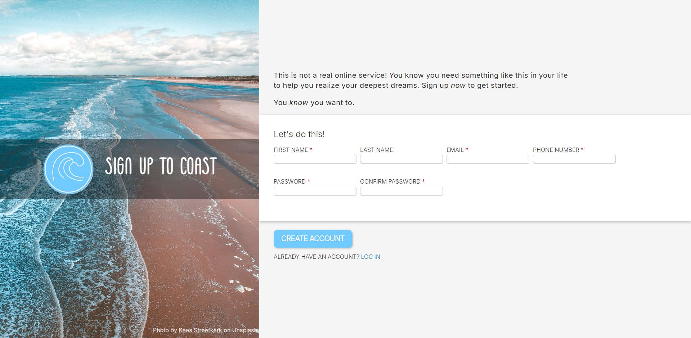

# Mockup Sign-up Page

A lightweight, proof of concept page built with vanilla CSS and JS. No frameworks, no headaches.

## Features

- Fast & efficient: Small amount of resources lead to quick load times

- Modern design: Clean, sleek, and user-friendly interface

- Dynamic layout: Fully responsive, adapts seamlessly to any screen size

- Pure vanilla stack: Built entirely with HTML, CSS, and JS. Simple but powerful.

## Purpose

This project serves as a mockup template for a website's sign-up page, ideal for learning, prototyping, or integrating into larger projects.

## Showcase

You can acess a live demo here on GitHub [right away](https://dyegocouto.github.io/signup-form/).

